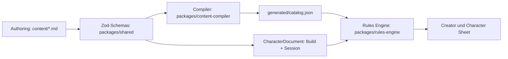

# Architektur

Die erlaubte Abhängigkeitsrichtung lautet:

```text
Legacy- und Custom-Content
  -> gemeinsame Schemas
  -> Content Compiler
  -> generierter Katalog
  -> Rules Engine
  -> Character Builder
```

`npm run architecture:audit` prüft produktive TypeScript-Importe auf
Gegenrichtungen. Insbesondere darf die Rules Engine keine React-, Browser-,
Compiler- oder UI-Abhängigkeit besitzen; die UI darf keinen Rohcontent laden.

## Schichten



Der Authoring-Layer ist die einzige von Menschen gepflegte Regelquelle. Der
Compiler liest YAML-Frontmatter und Markdown-Body, validiert Schema,
Referenzen, Choice-Grenzen und Zyklen und erzeugt einen stabil sortierten
Katalog samt SHA-256-Hash. Die Rules Engine nimmt nur Katalog und das
versionierte `CharacterDocument` mit getrenntem Build und Session State
entgegen. Creator und Character Sheet verwenden dasselbe ausgewertete Modell.
Die React-Anwendung definiert keine Klassen, Feats oder Formeln selbst.

## Pakete

- `packages/shared`: strikte Zod-Schemas, Schema-Version und gemeinsame Typen
- `packages/content-compiler`: Migration, Parser, Validator, Reports und
  reproduzierbare Generierung
- `packages/rules-engine`: Prädikate, Effekte, Choice-Auflösung und
  Charakterberechnung ohne Browser-API
- `apps/character-builder`: UI, lokale Speicherung, Import, Export und Druck
- `generated`: eingecheckte, reproduzierbare Build-Artefakte

## Datenfluss

`npm run content:migrate` überführt die 64 Legacy-Quellen nachvollziehbar in
`content/`. `npm run content:compile` erzeugt die Runtime-Daten.
`content:check-generated` kompiliert im Speicher erneut und vergleicht die drei
Artefakte bytegenau. Der Builder validiert den importierten Katalog erneut mit
Zod und reicht jede Zustandsänderung an `calculateCharacter` weiter.

## Grenzen

- Legacy-Quellen bleiben als historische Eingabe erhalten.
- Nicht eindeutig formalisierte Regeln sind
  `kind: text, machineReadable: false` und werden nie als berechneter Effekt
  ausgegeben.
- Bestiary-Daten mit `legacySystem: dnd5e` sind vom Character Builder isoliert.
- Katalog- und Charakterformat sind unabhängig versioniert.
- Zeitstempel stehen nur in konkreten Charaktermigrationen, nie im Katalog.

## Build

Development kompiliert vor dem Vite-Start und beobachtet Contentänderungen.
Production kompiliert, prüft Typen und Tests und baut danach die Workspaces.
`npm run verify` ist der Merge-Vertrag für Code, Content, Migration,
generierte Dateien, Unit-/Integrationstests, Build, Playwright und Formatierung.
